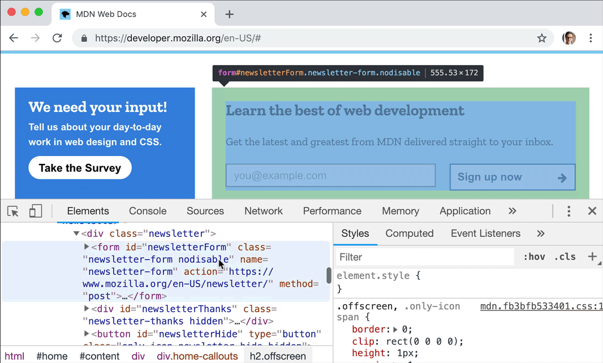
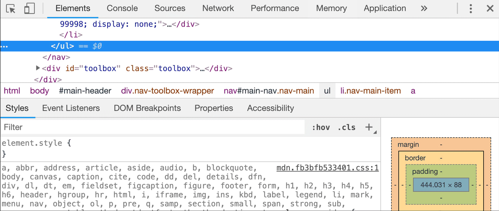
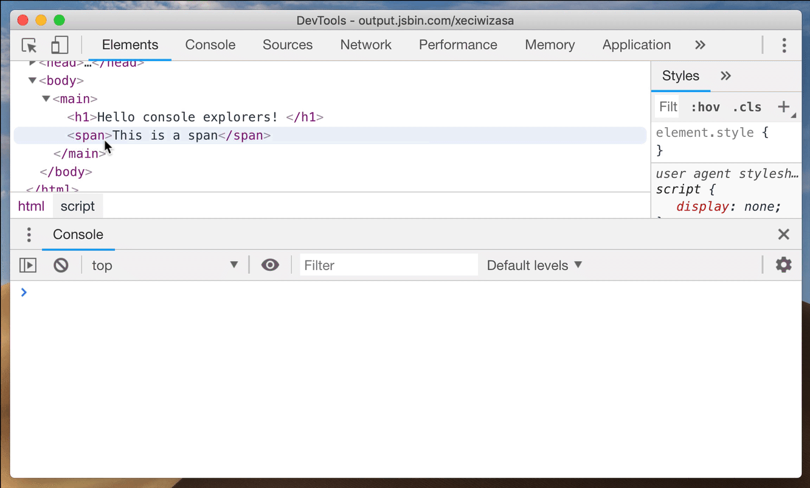

# `Chrome debug`

## 一、快捷键和通用技巧

### 1、切换 `DevTools` 窗口的展示布局

&emsp;&emsp;使用一个快捷键 `ctrl + shift + D (⌘ + shift + D Mac)` 来实现位置的切换（通常是从 开始的位置 到 右边位置， 但是如果一开始就是右边的位置那么会切换到左边的位置）。

### 2、切换 `DevTools` 的面板

&emsp;&emsp;日常开发中，我们常需要从元素面板跳转到资源面板并返回，这样往返的来调试我们的代码。

- 按下 `ctrl + [` 和 `ctrl + ]` 可以从当前面板的分别向左和向右切换面板。

- 按下 `ctrl + 1` 到 `ctrl + 9` 可以直接转到编号 `1...9` 的面板( `ctrl + 1` 转到元素面板，`ctrl + 4` 转到网络信息面板等等)

**请注意!** 我们在上面介绍的第二组快捷键默认被禁用了。你可以通过 `DevTools > Settings > Preferences > *Appearance*` 来打开这个选项：

### 3、`copying` & `saving`

&emsp;&emsp;在调试的过程中，我们总要对 `Dev Tools` 里面的数据进行**复制**或者**保存**的操作。

#### 1） `copy()`

&emsp;&emsp;你可以通过全局的方法 `copy()` 在 `Console` 里 `copy` 任何你能拿到的资源。

#### 2）`Store as global`

&emsp;&emsp;如果你在 `console` 中打印了一堆数据 (例如你在 `App` 中计算出来的一个数组) ，然后你想对这些数据做一些额外的操作比如我们刚刚说的 `copy` (在不影响它原来值的情况下) 。 那就可以将它转换成一个全局变量，只需要 右击 它，并选择 “`Store as global variable`” (保存为全局变量)选项。第一次使用的话，它会创建一个名为 `temp1` 的变量，第二次创建 `temp2`，第三次 ... 。

#### 3）保存堆栈信息`Stack trace`

&emsp;&emsp;大多数情况下都不是一个人开发一个项目，而是一个团队协作，那么 如何准确的描述问题，就成为了沟通的关键 ，这时候 `console` 打印出来的堆栈跟踪的信息对你和同事来说就起大作用了，可以省去很多沟通成本，所以你可以直接把堆栈跟踪的信息保存为一个文件，而不只是截图发给对方：

### 4、使用 `Command`

&emsp;&emsp;如果你使用过 `WebStorm` 中的 `Find Action` (查找动作) 或者 `Visual Studio Code` 中的 `Command Palette` 的话，那么在 `DevTools` 中的 `Command` 菜单也与之类似。在 `Chrome` 的调试打开的情况下 按下 `[ Ctrl] + [Shift] + [P] (Mac： [⌘] + [Shift]+ [P] )`。或者使用 `DevTools` 的 `dropdown` 按钮下的这个选项。

### 5、节点截图 & 全屏截图

&emsp;&emsp;当你只想对一个特别的 `DOM` 节点进行截图时，你可能需要使用其他工具弄半天，但现在你直接选中那个节点，打开 `Command` 菜单并且使用**节点截图**的就可以了。不只是这样，你同样可以用这种方式**全屏截图**，通过 `Capture full size screenshot` 命令。

> 注：节点截图有时会失效，全屏截图暂时没有遇到问题，建议大家使用后者。

### 6、快速切换面板

&emsp;&emsp;`DevTools` 使用双面板布局，形式一般是：元素面板 + 资源面板 ，它根据屏幕可用的部分，经常将不同面板横向或者纵向的排列，以适合阅读的方式展示出来。但有时候我们并不喜欢默认的布局。打开 `Commands` 菜单并且输入 `layout`，你会看到 2 到 3 个可供选择的项(这里不再显示你已经激活的选项)：

- 使用横向面板布局
- 使用纵向面板布局
- 使用自动面板布局

### 7、代码块的使用

&emsp;&emsp;`Snippets`允许你存放 `JavaScript` 代码到 `DevTools` 中，方便你复用这些 `JavaScript` 代码块。进入到 `Sources` 面板，在导航栏里选中 `Snippets` 这栏，点击 `New snippet`(新建一个代码块) ，然后输入你的代码之后保存，大功告成！现在你可以通过右击菜单或者快捷键： `[ctrl] + [enter]` 来运行它了。

&emsp;&emsp;当我在 `DevTools` 中预设了一组很棒的代码块以后，可以不必通过 `Sources` 来运行它们。使用 `Command Menu` ，输入 `!` ，来筛选预设代码块。

## 二、`Console` 中的技巧

&emsp;&emsp;在 `Chrome` 中的 `Console` 面板里，有这许多隐藏的技巧。例如，在 `Console` 中使用 `async await` 语法，可以直接使用 `await`，`Console` 默认被 `async` 包裹。

### 1、`$0`

&emsp;&emsp;在 `Chrome` 的 `Elements` 面板中， `$0` 是对我们当前选中的 `html` 节点的引用。理所当然，`$1` 是对上一次我们选择的节点的引用，`$2` 是对在那之前选择的节点的引用，等等。一直到 `$4`。

### 2、`$` 和 `$$`

&emsp;&emsp;如果没有在 `App` 中定义过 `$` 变量 (例如 `jQuery` )的话，它在 `console` 中就是 `document.querySelector` 的别名。`$$` 是 `document.QuerySelectorAll` 的别名，并且它返回的是：一个节点的数组 ，而不是一个 `Node list`。本质上来说 `Array.from(document.querySelectorAll('div')) === $$('div')`。

### 3、`$_`

&emsp;&emsp;`$_` 是对上次执行的结果的引用。

### 4、条件断点

&emsp;&emsp;假设有一个包含 200 个元素的循环，但是你只对第 110 次循环的结果感兴趣，又或者你只对一些满足某些条件的结果感兴趣，怎么办呢？

&emsp;&emsp;这样的情况下，你可以设置一个条件断点：

- 右击行号，选择 `Add conditional breakpoint`...(添加条件断点)

- 或者右击一个已经设置的断点并且选择 `Edit breakpoint`(编辑断点)

- 然后输入一个执行结果为 `true` 或者 `false` 的表达式（它的值其实不需要完全为 `true` 或者 `false` 尽管那个弹出框的描述是这样说的）。

&emsp;&emsp;在这个表达式中你可以使用任何这段代码可以获取到的值（当前行的作用域）。如果条件成立，这个断点就会暂停代码的执行。

### 5、`console.dir`

&emsp;&emsp;有时候你想要打印一个 `DOM` 节点。 `console.log` 会将这个交互式的元素渲染成像是从 `Elements` 中剪切出来的一样。使用 `console.dir` 就可以查看这个节点所关联到的真实的 `js` 对象，并且想要查看他的属性。

## 三、 `Drawer` 常识

&emsp;&emsp;当你在 `DevTools`（任何选项卡）中时，按 `[esc]` 来显示它，再次按 `[esc]` 隐藏它。Drawer 里隐藏着许多其他功能，大多数时候你可能不需要用到它们。

- `Animations`
- `Changes`
- `Console`
- `Coverage`
- `Network conditions`
- `Performance monitor`
- `Quick source`
- `Remote devices`
- `Rendering`
- `Request blocking`
- `Search`
- `Sensors`
- `What’s new`

### 1、检查代码 `coverage`

&emsp;&emsp;使用 `coverage` 面板来获得关于冗余代码的摘要-细节信息。使用 `Drawer` 菜单或者 `Command` 菜单来打开它。`DevTools` 的 `coverage` 工具可以跟踪当前加载的 `JS` 和 `CSS` 文件的哪些行正在被执行 ，并显示未使用字节的百分比 。它用绿色的线条标记运行和用红色的线条标记未运行

### 2、检查修改的内容

&emsp;&emsp;使用 `DevTools' Drawer` 中的更改工具。它不仅会使用差异形式的变化（像 `Git` 这样的源控制工具一样）向你展示，同时还可以撤销它们。

> 总结自掘金小册 [《你不知道的 Chrome 调试技巧》](https://juejin.im/book/5c526902e51d4543805ef35e)
